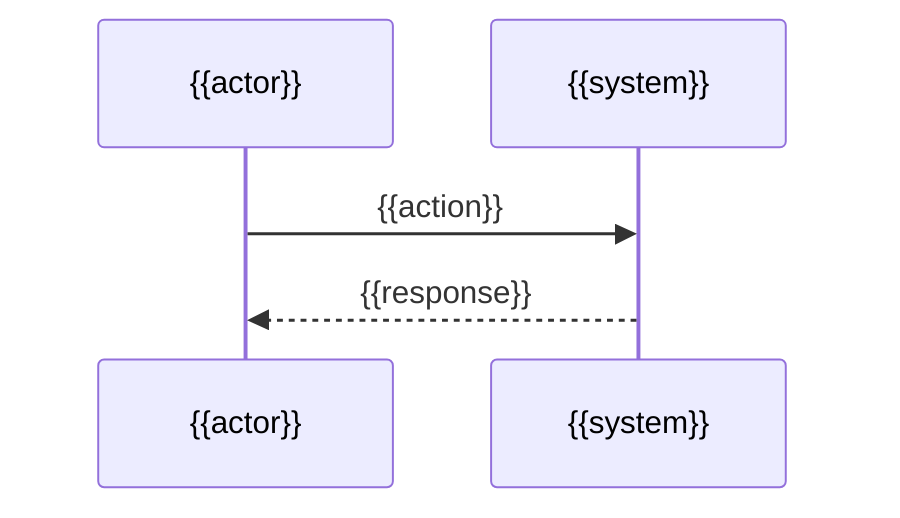

# Design: {{change-name}}

> Generated by sdd-ff | {{date}}

## 架构概览

<!-- 系统架构层面的变更说明 -->

```mermaid
graph {{direction}}
    {{component relationships}}
```

## 组件设计

### {{组件 1}}

- **职责**：
- **位置**：`{{file-path}}`
- **依赖**：

### {{组件 2}}

- **职责**：
- **位置**：`{{file-path}}`
- **依赖**：

## 数据模型

<!-- 数据结构、数据库 schema、类型定义 -->

```{{lang}}
{{data model}}
```

## 关键路径

<!-- 核心执行路径，从用户请求到最终响应 -->



## 技术决策

<!-- 设计层面的技术选型和理由 -->

| # | 决策 | 选择 | 理由 |
|---|------|------|------|
| TD1 | {{决策点}} | {{选择}} | {{理由}} |
